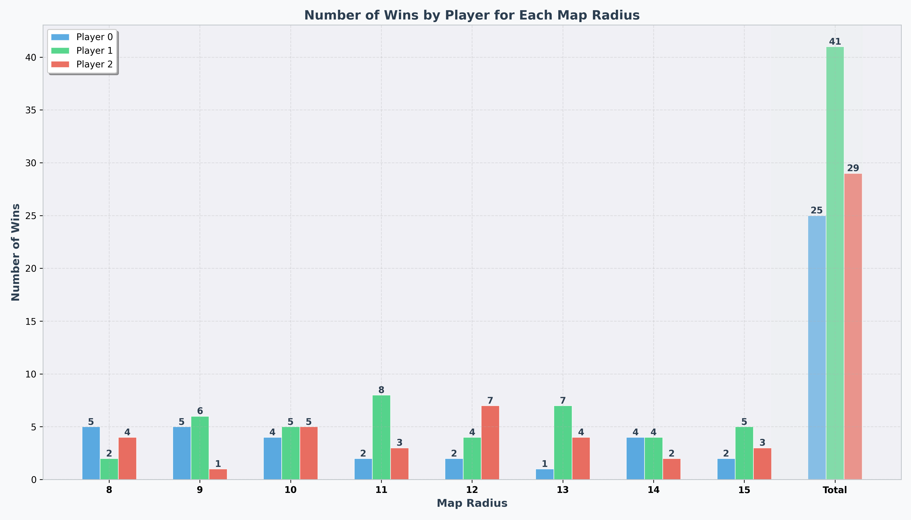

# Dau Truong AI 2025
Example command:
```bash
python main.py --map examples/maps/map.json --agents examples/agents/bot4/main.py examples/agents/bot5/main.py examples/agents/bot6/main.py --output data/logs/bot4_vs_bot5_vs_bot6.json
```

Before running the command, make sure the agent file is executable by running the following command:
```bash
chmod +x examples/agents/bot1/main.py
chmod +x examples/agents/bot2/main.py
chmod +x examples/agents/bot3/main.py
chmod +x examples/agents/bot4/main.py
chmod +x examples/agents/bot5/main.py
chmod +x examples/agents/bot6/main.py
chmod +x examples/agents/bot7/main.py
chmod +x examples/agents/bot8/main.py
chmod +x examples/agents/bot9/main.py
```

Currently, the runner is taking a agent as python file, could change to executable file by deleting the `python` in the `execute_agent` method in `runner.py` file.
## Generating Maps

To generate maps for the competition:

```bash
python generate_map.py --num 10
```

This command will generate 10 random maps for each radius from 8 to 15 and save them in the 'maps' folder. You can adjust the number of maps by changing the `--num` parameter.

## Visualizing Results
```bash
python evaluate.py --map maps --agents examples/agents/bot4/main.py examples/agents/bot5/main.py examples/agents/bot6/main.py --output output/
```

This command evaluates agent performance across all maps, generating statistics and visualizations that show win distribution by map size. Results are saved to your specified output directory. If you have matplotlib issues, try using the `uv` package manager instead.


